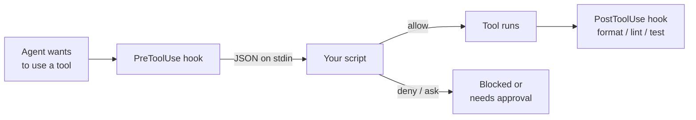

# Mastering the Basics: Agents, Subagents, Skills & Hooks in VS Code Copilot

by Alexander Opalic

---
layout: center
---

# Quick heads-up 👋

<div class="max-w-2xl mx-auto text-left space-y-5 mt-10 text-xl leading-relaxed">

<div>👉&nbsp; This one's a bit more **spontaneous** — I jumped in as a short-notice replacement</div>

<div>👉&nbsp; It's also my **first time giving two talks back-to-back** at a conference</div>

<div>👉&nbsp; So if something isn't 100% perfect, **please bear with me** 🙏</div>

<div>👉&nbsp; Let's have some fun and **dive in!**</div>

</div>

---
layout: image
image: /copilotWorkshop/karpathy.png
backgroundSize: contain
---

---

## Talk Outline

1. What is an Agent? (LLM → Agent transformation)
2. Context Engineering (the real skill)
3. Back Pressure (core validation concept)
4. AGENTS.md (open standard)
5. Subagents (specialized invocation)
6. Skills (portable workflows)
7. Hooks (deterministic control)
8. Live Demo

---
layout: center
---

## 🙋 Who has used GitHub Copilot in VS Code?

---

# About me

<About />

---
layout: section
---

# What is an Agent?

---

## The Transformation: LLM → Agent

<div class="xd">

<div class="row">

<div class="xd-box b1" v-click="1">
  <div class="t">LLM</div>
  <div class="s">just a text<br>generator</div>
</div>

<div class="op" v-click="2">+</div>

<div class="xd-box b2" v-click="2">
  <div class="t">Tools</div>
  <div class="s">read news,<br>call APIs,<br>edit files</div>
</div>

<div class="op" v-click="3">+</div>

<div class="xd-box b3" v-click="3">
  <div class="t">Agentic Loop</div>
  <div class="s">think → act →<br>observe → repeat</div>
</div>

<div class="op eq" v-click="4">=</div>

<div class="xd-box b4" v-click="4">
  <div class="t">🤖 Agent</div>
  <div class="s">interacts with<br>the world</div>
</div>

</div>

<div class="caption" v-click="5">An LLM can only <em>talk</em>. Give it tools + a loop, and it can <em>do</em>.</div>

</div>

<style>
.xd { margin-top: 2.2rem; font-family: 'Caveat', 'Comic Sans MS', cursive; }
.xd .row {
  display: flex; align-items: center; justify-content: center; gap: 1.1rem;
}
.xd-box {
  border: 2.5px solid #fff;
  border-radius: 255px 15px 225px 15px / 15px 225px 15px 255px;
  padding: 1rem 1.3rem; text-align: center; min-width: 130px;
  background: rgba(255,255,255,0.02);
}
.xd-box .t { font-size: 1.9rem; font-weight: 700; line-height: 1; }
.xd-box .s { font-size: 1.15rem; opacity: 0.75; margin-top: 0.45rem; line-height: 1.1; }
.b1 { transform: rotate(-1deg); }
.b2 { transform: rotate(1deg); border-color: #ff6bed; }
.b3 { transform: rotate(-1.2deg); border-color: #ff6bed; }
.b4 {
  transform: rotate(0.8deg); border-color: #ff6bed;
  box-shadow: 0 0 0 4px rgba(255,107,237,0.12);
}
.b4 .t { color: #ff6bed; }
.xd .op { font-size: 2.6rem; font-weight: 700; opacity: 0.85; }
.xd .op.eq { color: #ff6bed; }
.xd .caption {
  margin-top: 2.4rem; text-align: center; font-size: 1.7rem; opacity: 0.85;
}
.xd .caption em { color: #ff6bed; font-style: normal; }
</style>

---
layout: image
image: /copilotWorkshop/agent.png
backgroundSize: contain
---

---

## The Agentic Loop (nanocode)

```shell
nanocode | claude-opus-4-5 | /Users/alexanderopalic/Projects/typescript/nanocode

────────────────────────────────────────────────────────────────────────────────
❯  create a simple typescript file as a sum function
────────────────────────────────────────────────────────────────────────────────
[agentLoop] Starting with 1 messages
[agentLoop] Got response, stop_reason: tool_use

⏺ Write(src/sum.ts)
  ⎿  ok
[agentLoop] Starting with 3 messages
[agentLoop] Got response, stop_reason: end_turn

⏺ Created `src/sum.ts` with a simple sum function that takes two numbers and returns their sum.
```

**~350 lines of TypeScript** to understand how Claude Code works.

---

## The Agentic Loop (Code)

```typescript
async function agentLoop(messages: Message[], systemPrompt: string): Promise<Message[]> {
  const response = await callApi(messages, systemPrompt)
  printResponse(response)

  const toolResults = await processToolCalls(response.content)
  const newMessages = [...messages, { role: 'assistant', content: response.content }]

  if (toolResults.length === 0) {
    return newMessages  // No tools called, we're done
  }

  return agentLoop(  // Loop again with tool results
    [...newMessages, { role: 'user', content: toolResults }],
    systemPrompt
  )
}
```

The entire request → response → execute → loop cycle in ~15 lines.

---

## Tool Registration

```typescript
const TOOLS = new Map([
  ['read', {
    description: 'Read file with line numbers',
    schema: { path: 'string', offset: 'number?', limit: 'number?' },
    execute: read
  }],
  ['write', {
    description: 'Write content to file',
    schema: { path: 'string', content: 'string' },
    execute: write
  }],
  ['bash', {
    description: 'Run shell command',
    schema: { cmd: 'string' },
    execute: bash
  }]
])
```

---

## A Complete Tool Implementation

```typescript
async function read(args: Record<string, unknown>): Promise<string> {
  const path = args.path as string
  const text = await Bun.file(path).text()
  const lines = text.split('\n')
  const offset = (args.offset as number) ?? 0
  const limit = (args.limit as number) ?? lines.length
  return lines
    .slice(offset, offset + limit)
    .map((line, i) => `${(offset + i + 1).toString().padStart(4)}| ${line}`)
    .join('\n')
}
```

---
layout: image
image: /copilotWorkshop/agentTools.png
backgroundSize: contain
---

---

## VS Code Copilot Built-in Tools

- ⟨⟩ **agent** — Delegate tasks to other agents
- ⓘ **askQuestions** — Ask questions to clarify requirements
- ✎ **edit** — Edit files in your workspace
- ▷ **execute** — Execute code and applications
- ⧉ **read** — Read files in your workspace
- 🔍 **search** — Search files in your workspace
- ≡ **todo** — Manage and track todo items
- ✕ **vscode** — Use VS Code features
- 🌐 **web** — Fetch information from the web

---
layout: section
---

# Context Engineering

---
layout: image
image: /copilotWorkshop/agentContext.png
backgroundSize: contain
---

---

<ContextWindowVisualizer />

---
layout: quote
---

> "Context engineering is the art and science of filling the context window with just the right information at each step of an agent's trajectory."
>
> — LangChain/Manus webinar

---

## Context Window Utilization

<ContextUtilizationVisualizer />

---

<ContextFillupVisualizer />

---

## Three Long-Horizon Techniques

From [Anthropic's guide](https://www.anthropic.com/engineering/effective-context-engineering-for-ai-agents):

1. **Compaction** — Summarize history, reset periodically
2. **Structured note-taking** — External memory systems
3. **Sub-agent architectures** — Distribute work across focused contexts

---

## How Compaction Actually Works

<CompactionMechanism />

<div class="text-xs opacity-50 mt-2">

Traced from VS Code Copilot Chat agent source (`extensions/copilot/.../summarizedConversationHistory.tsx`)

</div>

---
layout: center
---

## 🧠 Working memory

<div class="text-xl opacity-80 mb-6 max-w-3xl">What's active in your head <em>right now</em> — the sentence you're reading. <span class="opacity-60">Volatile, small.</span></div>

<div class="rounded-lg border-2 border-sky-400/50 p-5 max-w-3xl">
<div class="text-sky-400 font-bold mb-2">In VS Code Copilot</div>
The chat session's <strong>context window</strong>. Watch the fill meter in the chat box — when it fills, Copilot auto-summarizes, or run <code>/compact</code>. Start a <strong>new session</strong> to reset it.
</div>

---
layout: center
---

## 📚 Semantic memory

<div class="text-xl opacity-80 mb-6 max-w-3xl">Factual knowledge you just <em>know</em> — "Python is interpreted." <span class="opacity-60">No need to re-learn it.</span></div>

<div class="rounded-lg border-2 border-green-400/50 p-5 max-w-3xl">
<div class="text-green-400 font-bold mb-2">In VS Code Copilot</div>
<strong>Custom instructions</strong> — project facts the agent always loads: <code>.github/copilot-instructions.md</code>, <code>AGENTS.md</code>, and scoped <code>*.instructions.md</code> files (with an <code>applyTo</code> glob).
</div>

---
layout: center
---

## 🛠️ Procedural memory

<div class="text-xl opacity-80 mb-6 max-w-3xl">Learned skills — riding a bike. <span class="opacity-60">You don't re-derive it each time.</span></div>

<div class="rounded-lg border-2 border-amber-400/50 p-5 max-w-3xl">
<div class="text-amber-400 font-bold mb-2">In VS Code Copilot</div>
<strong>Agent Skills</strong> — a folder per skill at <code>.github/skills/&lt;name&gt;/SKILL.md</code>. The agent loads one itself when its description matches the task. Portable across Copilot CLI & cloud.
</div>

---
layout: center
---

## 🎞️ Episodic memory

<div class="text-xl opacity-80 mb-6 max-w-3xl">Personal experience — that 3-hour debug session. <span class="opacity-60">Tied to events you lived.</span></div>

<div class="rounded-lg border-2 border-purple-400/50 p-5 max-w-3xl">
<div class="text-purple-400 font-bold mb-2">In VS Code Copilot</div>
The <strong>Memory tool</strong> <span class="opacity-60">(preview)</span>. The agent saves notes to <code>/memories/</code> (you) and <code>/memories/repo/</code> (project); the first ~200 lines auto-load each session. Manage via <strong>Chat: Show Memory Files</strong>.
</div>

---

## Four types of memory — in VS Code Copilot

| Memory | Human version | In VS Code Copilot |
| --- | --- | --- |
| <span class="text-sky-400 font-bold">🧠 Working</span> | What's in your head now | Context window · `/compact` · new session |
| <span class="text-green-400 font-bold">📚 Semantic</span> | Facts you just know | `.github/copilot-instructions.md` · `AGENTS.md` · `*.instructions.md` |
| <span class="text-amber-400 font-bold">🛠️ Procedural</span> | Learned skills | Agent Skills — `.github/skills/<name>/SKILL.md` |
| <span class="text-purple-400 font-bold">🎞️ Episodic</span> | Lived experiences | Memory tool (preview) — `/memories/` · "Show Memory Files" |

<p class="mt-6 opacity-70">Semantic & procedural are Markdown <em>you</em> write. Episodic is Markdown the <em>agent</em> writes for itself.</p>

---
layout: section
---

# Back Pressure

---

## Why Back Pressure Matters

**Back pressure** = automated feedback that validates agent work

- Without back pressure, **you** become the validation layer
- Agents cannot self-correct if nothing tells them something is wrong
- With good back pressure, agents detect mistakes and iterate until correct

> "If you're directly responsible for checking each line is valid, that's time taken away from higher-level goals."

---

## Back Pressure Sources

| Source | What It Validates |
|--------|-------------------|
| **Type system** | Types, interfaces, contracts |
| **Build tools** | Syntax, imports, compilation |
| **Tests** | Logic, behavior, regressions |
| **Linters** | Style, patterns, best practices |

<Callout type="info">

**Key insight:** Expressive type systems + good error messages = agents can self-correct.

</Callout>

---
layout: section
---

# AGENTS.md

---

## What is AGENTS.md?

**What:** An open standard for agent-specific documentation

**Where:** Repository root (works in monorepos too)

**Who:** Works with Copilot, Claude, Cursor, Devin, 20+ agents

> "While README.md targets humans, AGENTS.md contains the extra context coding agents need."

---
layout: iframe
url: https://agents.md/
---

---

## AGENTS.md Structure

```markdown
# AGENTS.md

## Dev Environment
- How to set up and navigate

## Build & Test Commands
- `pnpm install && pnpm dev`
- `pnpm test:unit`

## Code Style
- TypeScript strict mode
- Prefer composition over inheritance

## PR Instructions
- Keep PRs small and focused
```

**Key:** No required fields—use what helps your project.

---
layout: image
image: /copilotWorkshop/bloatedAgent.png
backgroundSize: contain
---

---
layout: two-cols-header
---

## Before vs After: Progressive Disclosure

::left::

<h3 class="text-red-400 font-bold text-xl mb-4">❌ Bloated (847 lines)</h3>

```markdown
# AGENTS.md

## API Endpoints
[200 lines of docs...]
## Testing Strategy
[150 lines of docs...]
## Architecture
[300 lines of docs...]
## Code Style
[100 lines of rules...]
## Deployment
[97 lines of docs...]
```

<p class="text-yellow-400 mt-4 text-sm">40% context consumed before work starts</p>

::right::

<h3 class="text-green-400 font-bold text-xl mb-4">✅ Lean (58 lines)</h3>

```markdown
# AGENTS.md

## Quick Start
pnpm install && pnpm dev

## Docs Reference
| Doc | When to read |
|-----|--------------|
| docs/api.md | API work |
| docs/testing.md | Tests |
| docs/arch.md | Design |
```

<p class="text-cyan-400 mt-4 text-sm">Docs loaded on-demand when needed</p>

---
layout: image
image: /copilotWorkshop/progressiveDisc.png
backgroundSize: contain
---

---

## The /learn Skill

```markdown
# Learn from Conversation

## Phase 1: Deep Analysis
- What patterns or approaches were discovered?
- What gotchas or pitfalls were encountered?
- What architecture decisions were made?

## Phase 2: Categorize & Locate
Read existing docs to find the best home.

## Phase 3: Draft the Learning
Format to match existing doc style.

## Phase 4: User Approval (BLOCKING)
Present changes, wait for explicit approval.

## Phase 5: Save
After approval, save the learning.
```

---
layout: section
---

# Subagents

---

## Subagents in VS Code

**How to invoke:**

1. Enable tools in Copilot Chat (hammer icon)
2. Call explicitly with `#runSubagent`
3. Or accept when Copilot suggests one

---

## Use Cases

- Specialized searches (explore codebase, web, docs)
- Long-running tasks (data analysis, refactoring)
- TDD workflows (test generation, validation)
- Multi-step processes (research, summarize, act)

---

## Explore Subagent Flow

<SubagentDiagram task="Find auth files" :files="['Auth.tsx', 'auth.ts', 'authService.ts']" />

Click **Start** to see how the main agent delegates file search to a specialized Explore subagent.

---

## Parallel Subagent Execution

<ParallelSubagentDiagram
  task="Research Vue 3 reactivity"
  :agents="[
    { name: 'Web Agent', icon: '🌐', color: '#3b82f6', domain: 'Docs, GitHub', findings: ['Official guide', 'RFC #123', 'GitHub issue'] },
    { name: 'Community', icon: '💬', color: '#8b5cf6', domain: 'Reddit, SO', findings: ['r/vuejs post', 'Top SO answer', 'Discord tip'] },
    { name: 'Codebase', icon: '📂', color: '#10b981', domain: 'Project files', findings: ['useAuth.ts', 'store.ts', 'api/client.ts'] }
  ]"
/>

Click **Start** to see the fan-out/fan-in pattern where multiple subagents search in parallel.

---

## Nested Subagents: Orchestrator Pattern

<NestedSubagentDiagram
  task="Build user authentication"
  :criteria="[
    { id: 'AC1', title: 'Login form', icon: '🎨', color: '#3b82f6' },
    { id: 'AC2', title: 'Auth API', icon: '🔌', color: '#8b5cf6' },
    { id: 'AC3', title: 'Unit tests', icon: '🧪', color: '#10b981' }
  ]"
/>

Main chat writes a **`spec.md`**, hands it to an **Orchestrator** subagent, which spawns one **implementation subagent per acceptance criterion**.

---

## Subagent in nanocode: Fetch Tool

```shell
nanocode | claude-opus-4-5 | /Users/alexanderopalic/Projects/typescript/nanocode

────────────────────────────────────────────────────────────────────────────────
❯ how does fc bayern played yesterday
────────────────────────────────────────────────────────────────────────────────
[agentLoop] Starting with 1 messages
[agentLoop] Got response, stop_reason: tool_use

⏺ Fetch(https://www.google.com/search?q=fc+bayern+munich+m)
  ⎿  I apologize, but I cannot access real-time sports results or ... +7 lines
[agentLoop] Starting with 3 messages
[agentLoop] Got response, stop_reason: tool_use

⏺ Fetch(https://www.espn.com/soccer/team/_/id/132/bayern-m)
  ⎿  Based on the information in the image, Bayern Munich's most  ... +7 lines
[agentLoop] Starting with 5 messages
[agentLoop] Got response, stop_reason: end_turn

⏺ FC Bayern Munich lost 2-1 to FC Augsburg in the Bundesliga yesterday.
```

The **Fetch tool** uses a subagent to summarize HTML responses before returning.

---
layout: section
---

# Skills

---
layout: image
image: /copilotWorkshop/howAgentSkills.png
backgroundSize: contain
---

---

## Real Skill: Plausible SEO Consultant

```shell
.claude/skills/plausible-insights/
├── skill.md              # Skill definition + quick start
├── scripts/              # Automation scripts
│   └── fetch-data.ts    # Fetch Plausible data CLI
└── references/           # On-demand docs (progressive disclosure)
    ├── quick-ref.md      # Common query patterns
    ├── api/
    │   ├── filters.md    # Filter syntax
    │   └── errors.md     # Error solutions
    └── seo/
        └── thresholds.md # Interpretation guidelines
```

The agent reads `skill.md` first. Reference docs load only when needed.

---

## Skill in Action

**User:** "Why is my bounce rate so high on the Vue posts?"

1. Description matches → skill.md loads (~500 tokens)
2. Agent runs: `bun cli top-pages --range 7d --pattern "/vue/"`
3. Agent reads `references/seo/thresholds.md` for interpretation
4. Agent fetches actual pages with WebFetch
5. Returns specific fixes based on real content

**Key:** Data shows symptoms. Content shows causes.

---
layout: section
---

# The Full Picture

---
layout: image
image: /copilotWorkshop/agentSum.png
backgroundSize: contain
---

---
layout: section
---

# Hooks

---

## What are Hooks?

**Skills guide** the agent. **Hooks control** it — deterministically.

- Run **your shell commands** at key lifecycle points of an agent session
- Not a suggestion to the model — **code that always runs**, with guaranteed outcomes
- Each hook gets **JSON on stdin**, can return **JSON on stdout** to influence the agent
- Works across **local, background, and cloud** agents

<Callout type="info">

Instructions *ask* the agent nicely. Hooks **enforce** — block a command, format a file, inject context, no matter how the agent was prompted.

</Callout>

---

## The 8 Lifecycle Events

| Event | Fires when… | Use for |
|-------|-------------|---------|
| `SessionStart` | first prompt of a session | inject project context |
| `UserPromptSubmit` | user sends a prompt | audit, add context |
| `PreToolUse` | **before** a tool runs | **block / approve / deny** |
| `PostToolUse` | **after** a tool succeeds | format, lint, test |
| `PreCompact` | before context is compacted | save state |
| `SubagentStart` / `SubagentStop` | subagent spawns / ends | track nested work |
| `Stop` | session ends | notify, report, cleanup |

---

## How a Hook Works



**Exit codes:** `0` = success (parse stdout) · `2` = block & tell the model why · other = warn, continue

---

## Configuration

Drop a JSON file in `.github/hooks/` — VS Code loads it automatically:

```json
{
  "hooks": {
    "PostToolUse": [
      {
        "type": "command",
        "command": "npx prettier --write ."
      }
    ]
  }
}
```

<Callout type="info">

Same format as **Claude Code** & **Copilot CLI** — VS Code also reads `.claude/settings.json`. Or run **`/hooks`** in chat to generate one.

</Callout>

---

## 🔒 The Killer Hook: Block reading `.env`

**Problem:** if the agent reads `.env`, your secrets flow into the LLM context → sent to the cloud, stored in transcripts/logs, maybe echoed back into chat.

- Secrets that **never enter context** can't leak
- A `PreToolUse` guard is a **hard data boundary**, not a style preference
- Inspect the path, return `permissionDecision: "deny"` — the agent is told *why*

---

## 🔒 The Guard Script

```bash
#!/bin/bash
INPUT=$(cat)
PATH_ARG=$(echo "$INPUT" | jq -r '.tool_input.file_path
  // .tool_input.path // .tool_input.command // ""')

if echo "$PATH_ARG" | grep -qiE \
  '(^|/)\.env($|\.)|\.(pem|key|p12|pfx)$|id_rsa|credentials|\.aws/|secrets/'; then
  echo '{"hookSpecificOutput":{"permissionDecision":"deny",
    "permissionDecisionReason":"Blocked: secret file. Use an env var name, not the value."}}'
  exit 0
fi
echo '{"continue":true}'
```

<Callout type="warn">

Also catch the **indirect** path — `cat .env` / `printenv` live in `tool_input.command`, not just file-read tools.

</Callout>

---

## More High-Value Hooks

- 🛑 **Block destructive commands** (`PreToolUse`) — `rm -rf /`, `git push --force`, `DROP TABLE`
- 🎨 **Auto-format & lint** (`PostToolUse`) — clean diffs, zero prompting, zero tokens
- ✅ **Typecheck / test after edits** (`PostToolUse`) — agent fixes its own breakage
- 🧭 **Inject context** (`SessionStart`) — branch, package manager, scripts — always current
- 🛡️ **Protect critical files** — lockfiles, `.github/workflows/`, `main` branch
- 🔔 **"Agent finished" notification** (`Stop`) — walk away, come back when it's done

---

## ...And Plenty More Ideas 💡

<div grid="~ cols-2 gap-x-8" class="text-sm">

<div>

**Quality & safety gates**
- 🟢 **Loop until green** (`Stop`) — refuse to finish while tests fail
- 🚫 **Pre-commit gate** (`PreToolUse`) — no commit if lint fails
- 📦 **Dependency guard** — block un-reviewed prod installs

</div>

<div>

**Observability & control**
- 📜 **Audit log** (`PostToolUse`) — every tool call on record
- 🛡️ **Prompt governance** (`UserPromptSubmit`) — catch secrets / PII
- 💾 **Backup before compaction** (`PreCompact`)
- 🌐 **Central policy server** (HTTP hook) — one rule set, whole team

</div>

</div>

<Callout type="info">

The point isn't the list — it's that **anything you can script, you can enforce**.

</Callout>

---
layout: center
---

## Recommended Starting Set

1. 🔒 **Secret-file guard** — keep `.env` out of context
2. 🛑 **Dangerous-command guard** — block the catastrophic shell call
3. 🎨 **Auto-format on edit** — consistent tree, no nagging

<Callout type="info">

Pure-win safety & quality rails. Tip: bundle the guards into **one `PreToolUse` script** — it already parsed stdin.

</Callout>

---
layout: section
---

# Live Demo

---

## Prerequisites

The demo uses `npx` (bundled with Node.js) and Python. Install for your platform:

**Mac (Homebrew):**
```bash
brew install node python
```

**Windows (winget):**
```bash
winget install OpenJS.NodeJS Python.Python.3.12
```

**Or download from:** [nodejs.org](https://nodejs.org) | [python.org](https://python.org)

**Verify:**
```bash
node --version && npx --version && python --version
```

---

## Demo: Building a Skill

1. **Enable Skills** in VS Code settings
2. **Install skill-creator** via CLI
3. **Prompt** to generate a new skill

---

## Step 1: Enable Skills

**VS Code Setting:**

```json
{
  "chat.useAgentSkills": true
}
```

Or via UI: `Settings → Search "agent skills" → Enable`

<Callout type="warn">
Still in preview — enable in VS Code Insiders for the latest features.
</Callout>

---
layout: image
image: /copilotWorkshop/settings.png
backgroundSize: contain
---

---

## Step 3: Create a new Skill

```md
---
name: hello
description: 'use it everytime the user writes alex'
---

# Hello SKill

if the user writes "alex", respond with "Hello, Alexander Opalic! How can I assist you today?"
```

---

<DemoVideo
  title="Create the hello skill"
  src="/videos/hello-skill.mp4"
  caption="Add .github/skills/hello/SKILL.md, then type “alex” in chat."
/>

---

## Step 3: Install skill-creator

```bash
npx skills add https://github.com/anthropics/skills --skill skill-creator
```

This adds the **skill-creator** skill to your project — a skill that helps you create new skills.

**Project structure after install:**

```
my-project/
└── .github/
    └── skills/
        └── skill-creator/
            └── SKILL.md
```

---

```shell
◇  Source: https://github.com/anthropics/skills.git
│
◇  Repository cloned
│
◇  Found 17 skills (via Well-known Agent Skill Discovery)
│
●  Selected 1 skill: skill-creator
│
◇  Detected 3 agents
│
◇  Install to
│  All agents (Recommended)
│
◇  Installation scope
│  Project
│
◇  Installation method
│  Symlink (Recommended)

│
◇  Installation Summary ──────────────────────────────╮
│                                                     │
│  ~/Projects/workshop/.agents/skills/skill-creator   │
│    symlink → Claude Code, GitHub Copilot, OpenCode  │
│                                                     │
├─────────────────────────────────────────────────────╯
│
◆  Proceed with installation?
│  ● Yes / ○ No
└
```

---

<DemoVideo
  title="Install skill-creator"
  src="/videos/install-skill-creator.mp4"
  caption="npx skills add https://github.com/anthropics/skills --skill skill-creator"
/>

---

## Step 3: Generate a New Skill

Important Skill name and folder name must match!

**Prompt:**

```
Create a skill that will use https://alexop.dev/llms.txt
and will answer any question regarding Vue or AI.

The skill should fetch the content and use the
#runSubagent command. The subagent should do the
heavy work and then report back to the main agent.
name of the skill is vue-ai-assistant
```

→ **skill-creator generates the SKILL.md for us**

---

## What Gets Generated

````markdown
---
name: vue-ai-assistant
description: Answer questions about Vue.js, Nuxt, and AI topics using Alexander Opalic's knowledge base. Use this skill when the user asks about Vue, Vue 3, Nuxt, Nuxt 3, Composition API, Vue Router, Pinia, Vite, AI, machine learning, LLMs, or related frontend/AI topics.
---

# Vue & AI Assistant

Answer questions about Vue.js ecosystem and AI topics by fetching knowledge from
https://alexop.dev/llms.txt and delegating research to a subagent.

## MANDATORY Workflow

1. **Fetch the knowledge base**: Use `fetch_webpage` to retrieve content from `https://alexop.dev/llms.txt`
2. **REQUIRED - Delegate to subagent**: Use `runSubagent` with the fetched content and user's question.
3. **Return the answer**: Present the subagent's findings to the user
````

---

<DemoVideo
  title="Generate the vue-ai-assistant skill"
  src="/videos/vue-ai-assistant.mp4"
  caption="skill-creator writes SKILL.md, then we ask a Vue question and it delegates to a subagent."
/>

---
layout: image
image: /copilotWorkshop/skillExample.png
backgroundSize: contain
---

---

## Bonus: The askQuestions Tool

VS Code Copilot can **ask clarifying questions** mid-task.

```md
help me to create a workout tracking app use the #askQuestions tool to find out how the tech specs should be
```

---

```shell
┌─────────────────────────────────────────────────────────────┐
│                     Platform (1/4)                          │
├─────────────────────────────────────────────────────────────┤
│ What platform should the workout tracking app target?       │
├─────────────────────────────────────────────────────────────┤
│ ★ Web App  Browser-based PWA, accessible anywhere      [✓]  │
├─────────────────────────────────────────────────────────────┤
│   iOS Native  Swift/SwiftUI for iPhone                      │
├─────────────────────────────────────────────────────────────┤
│   Android Native  Kotlin for Android devices                │
├─────────────────────────────────────────────────────────────┤
│   Cross-Platform  React Native or Flutter for iOS & Android │
├─────────────────────────────────────────────────────────────┤
│   Desktop  Electron app for Mac/Windows                     │
├─────────────────────────────────────────────────────────────┤
│ ✎ Other...  Enter custom answer                             │
└─────────────────────────────────────────────────────────────┘
```

---

<DemoVideo
  title="The #askQuestions tool"
  src="/videos/ask-questions.mp4"
  caption="Copilot asks tech-spec questions before scaffolding the workout app."
/>

---

## Subagent Fan-Out Pattern

**Prompt for VS Code Insiders:**

```
#runSubagent run 3 subagents that search the web
and tell me something interesting about Geretsried
```

This demonstrates the **fan-out/fan-in pattern** where multiple agents work in parallel.

---

<DemoVideo
  title="Subagent fan-out"
  src="/videos/subagent-fanout.mp4"
  caption="#runSubagent spins up 3 parallel web-search agents on Geretsried."
/>

---

## Live Action: Excalidraw Skill

**Install the skill:**

```bash
npx skills add https://github.com/softaworks/agent-toolkit --skill excalidraw
```

Install the Excalidraw Extension in VS Code for best experience.

**Prompt to customize with brand colors:**

```
Update the excalidraw skill to use these brand colors:

- Fill: rgb(33, 39, 55)
- Text: rgb(234, 237, 243)
- Accent: rgb(255, 107, 237)
- Card: rgb(52, 63, 96)
- Card Muted: rgb(138, 51, 123)
- Border: rgb(171, 75, 153)
```

→ Agent modifies the skill's SKILL.md to include color instructions

---

<DemoVideo
  title="Excalidraw skill with brand colors"
  src="/videos/excalidraw-brand.mp4"
  caption="The agent edits the skill’s SKILL.md to use our palette, then redraws."
/>

---
layout: image
image: /copilotWorkshop/robot.png
backgroundSize: contain
---

---

## More Community Skills

```bash
npx skills add https://github.com/anthropics/skills --skill frontend-design
npx skills add https://github.com/simonwong/agent-skills --skill code-simplifier
```

- **frontend-design** — creates polished, production-grade UI components
- **code-simplifier** — simplifies and refines code for clarity

Browse and discover skills at [agentskills.io](https://agentskills.io/)

---
layout: center
---

## Key Takeaways

1. **Agents = LLM + Tools + Loop** (nanocode shows this simply)
2. **Context is finite** — treat tokens as budget
3. **AGENTS.md** — standardized project context
4. **Subagents** — specialized agents for complex tasks
5. **Skills** — portable workflows that load on demand
6. **Hooks** — deterministic guardrails (keep secrets out of context!)

---

## Resources

- [VS Code: Using Agents](https://code.visualstudio.com/docs/copilot/agents/overview) — Agent types and session management
- [Anthropic: Effective Context Engineering](https://www.anthropic.com/engineering/effective-context-engineering-for-ai-agents) — Context engineering guide
- [VS Code: Introducing Agent Skills](https://www.youtube.com/watch?v=JepVi1tBNEE) — Agent Skills deep dive
- [VS Code: Agent Hooks (Preview)](https://code.visualstudio.com/docs/agents/concepts/hooks) — Lifecycle hooks for deterministic control
- [VS Code: Context Engineering Guide](https://code.visualstudio.com/docs/copilot/guides/context-engineering-guide) — Microsoft's context engineering workflow
- [AGENTS.md](https://agents.md/) — Open standard for agent documentation
- [Agent Skills Spec](https://agentskills.io/) — Open standard for portable agent skills
- [nanocode](https://github.com/alexanderop/nanocode) — Minimal agent implementation in TypeScript
- [Writing a Good CLAUDE.md](https://www.humanlayer.dev/blog/writing-a-good-claude-md) — Best practices for agent documentation
- [Plausible SEO Skill](https://github.com/alexanderop/claude-plausible-analytics) — Skills deep dive with Plausible example
- [Don't Waste Your Back Pressure](https://banay.me/dont-waste-your-backpressure/) — Why automated feedback loops make agents more effective
- [Workshop Solution](https://github.com/alexanderop/workshop) — Complete code examples from this workshop
- [Learn Prompt](https://alexop.dev/prompts/claude/claude-learn-command/) — Skill that helps agents learn from conversations

---
layout: end
class: text-center
---

# Thank You! 🙏

<div class="text-2xl opacity-80 mt-2">Questions?</div>

<div class="flex items-center justify-center gap-12 mt-12">

<div class="text-left">

### Want to read more about AI?

<div class="text-xl opacity-90 mt-3">
Tutorials, deep dives & experiments on my blog:
</div>

<a href="https://alexop.dev/tags/ai/" class="text-2xl font-mono mt-4 inline-block">
alexop.dev/tags/ai
</a>

</div>

<div class="bg-white p-4 rounded-2xl shadow-lg">
  
</div>

</div>

<div class="text-lg opacity-60 mt-12">Alexander Opalic</div>
